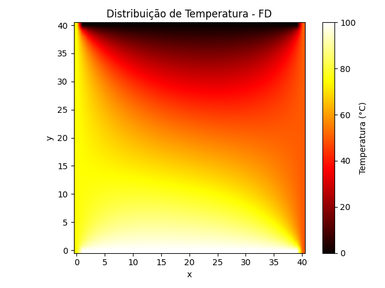
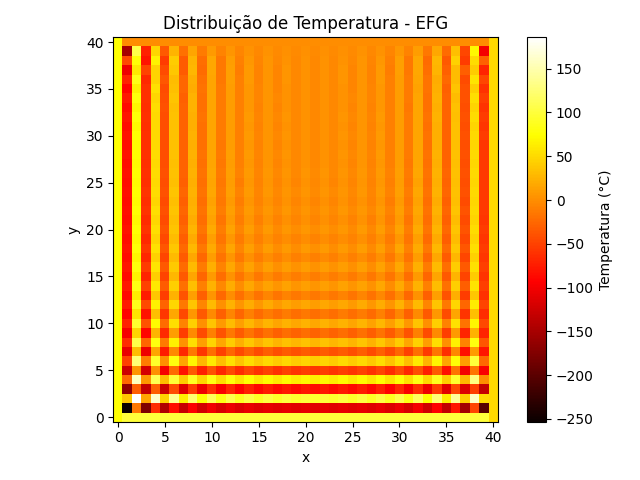

# Comparação Numérica de Métodos para a Equação de Laplace

Este projeto compara três métodos numéricos para resolver o problema da distribuição de temperatura em uma placa bidimensional com condições de contorno de Dirichlet, utilizando:

- 🔹 Diferenças Finitas (FD)
- 🔸 Elementos Finitos (FEM)
- ⚫ Element Free Galerkin (EFG)

---

## 📌 Objetivos

- Implementar e comparar diferentes técnicas numéricas para um mesmo problema físico
- Avaliar desempenho, qualidade da solução e facilidade de implementação
- Fornecer uma base sólida e documentada para fins didáticos e acadêmicos

---

## 📂 Documentação

A documentação está dividida em seções independentes, acessíveis a partir dos links abaixo:

1. 📖 [Equacionamento Físico do Problema](docs/01_equationamento_fisico.md)
2. 📐 [Discretização dos Métodos](docs/02_discretizacao_metodos.md)
3. 🧠 [Algoritmos e Implementação](docs/03_algoritmos_implementacao.md)
4. 📊 [Resultados Comparativos](docs/04_resultados_comparativos.md)
5. 📚 [Referências Bibliográficas](docs/05_referencias.md)

---

## ⚙️ Compilação e Execução

### Requisitos
- C++17
- [Eigen](https://eigen.tuxfamily.org/) (para EFG)
- Python 3 + matplotlib + numpy (para visualização)

### Compilar
```bash
make
```

### Executar
```bash
./heat_solver
```

Os resultados serão gerados em `data/` e os gráficos podem ser salvos com os scripts Python contidos no diretório `scripts/`.

---

## 📈 Visualizações

<div align="center">
  
  
  
</div>

---

## 🧑‍💻 Autor

Este repositório está sendo desenvolvido por Lucas Kriesel Sperotto, com foco em rigor técnico, aplicabilidade prática e fins educacionais.

---

## 📝 Licença

[MIT](LICENSE)
